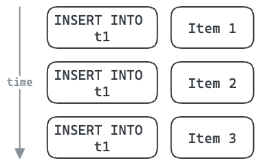
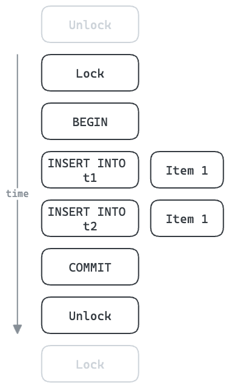
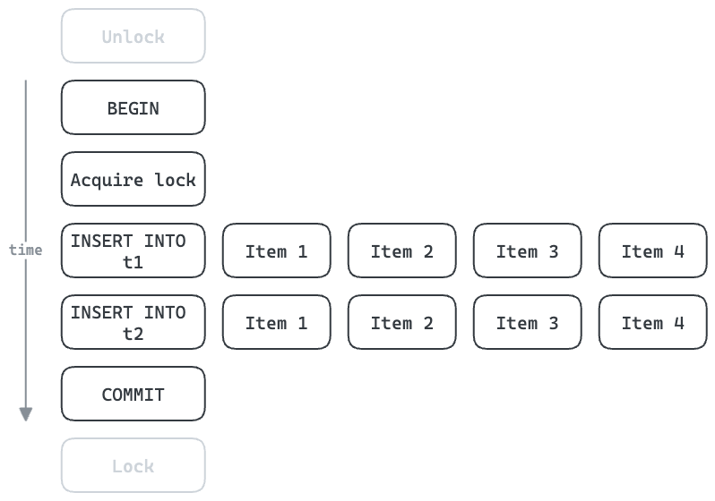

# Batch ain't one


_I got 99 problems, but a batch ain't one..._

Batch up multiple items for processing as a single unit.

## Why

Sometimes it is more efficient to process many items at once rather than one at a time. Especially when the processing step has overheads which can be shared between many items.

### Example: Inserting multiple rows

For example, each database operation, such as an `INSERT`, has the overhead of a round trip to the database.



Multi-row inserts can share this overhead between many items. This also allows us to share a single database connection to insert these three items, potentially reducing contention if the connection pool is highly utilised.


### Example: With locking and transactions

Insert into database tables can often be done concurrently. In cases where these must be done serially, throughput can suffer. In the example below, six round trips to the database are necessary for each item. All subsequent items must wait until this is finished.

If each round trip takes 1ms, then this results in a minimum of 6ms per item, or 167 items/sec maximum.



With batching, we can improve the throughput. Acquiring/releasing the lock and beginning/committing the transaction can be shared for the whole batch. With four items per batch, we can increase the theoretical maximum throughput to 667 items/sec. In reality each `INSERT` will take longer, but the multi-row inserts are likely to share some overheads in a similar way.



## Example

```rust
use std::{marker::Send, sync::Arc};

use async_trait::async_trait;
use batch_aint_one::{Batcher, Processor, BatchingStrategy};

#[derive(Debug, Clone)]
struct SimpleBatchProcessor;

#[async_trait]
impl Processor<String, String, String> for SimpleBatchProcessor {
    async fn process(&self, key: String, inputs: impl Iterator<Item = String> + Send) -> Vec<String> {
        // In this example:
        // - `key`: "A"
        // - `inputs`: ["1", "2"]
        inputs.map(|s| s + " processed").collect()
    }
}

tokio_test::block_on(async {
    let batcher = Arc::new(Batcher::new(SimpleBatchProcessor, BatchingStrategy::Size(2)));

    // Request handler 1
    let b1 = batcher.clone();
    tokio::spawn(async move {
        let output = b1.add("A".to_string(), "1".to_string()).await.unwrap();

        assert_eq!("1 processed".to_string(), output);

    });

    // Request handler 2
    let b2 = batcher.clone();
    tokio::spawn(async move {
        let output = b2.add("A".to_string(), "2".to_string()).await.unwrap();

        assert_eq!("2 processed".to_string(), output);
    });
});
```

## Roadmap

- [x] Tests
- [x] Better error handling
- [ ] Garbage collection for old generation placeholders
- [x] Docs
  - [x] Why – motivating example
  - [x] Code examples
- [x] Observability
