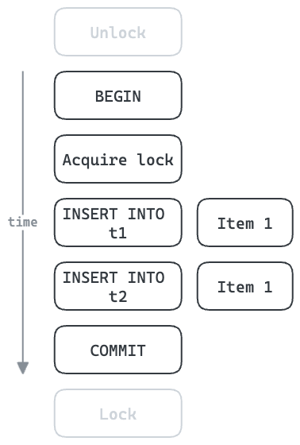

# Batch ain't one

[](https://github.com/ThomWright/batch-aint-one/actions/workflows/ci.yaml)
[](https://github.com/ThomWright/batch-aint-one/blob/main/LICENSE-MIT)
[](https://crates.io/crates/batch-aint-one)
[](https://docs.rs/batch-aint-one/latest/batch_aint_one/)

_I got 99 problems, but a batch ain't one..._

Batch up multiple items for processing as a single unit.

## Why

Sometimes it is more efficient to process many items at once rather than one at a time. Especially when the processing step has overheads which can be shared between many items.

Often applications work with one item at a time, e.g. _select one row_ or _insert one row_. Many of these operations can be batched up into more efficient versions: _select many rows_ and _insert many rows_.

## How

A worker task is run in the background. Many client tasks (e.g. message handlers) can submit items to the worker and wait for them to be processed. The worker task batches together many items and processes them as one unit, before sending a result back to each calling task.

## Use case: Inserting multiple rows into a database

For example, each database operation – such as an `INSERT` – has the overhead of a round trip to the database.


Multi-row inserts can share this overhead between many items. This also allows us to share a single database connection to insert these three items, potentially reducing contention if the connection pool is highly utilised.


## Use case: With transactions and locking

Inserts into database tables can often be done concurrently. In some cases these must be done serially, enforced using locks. This can be a significant throughput bottleneck.

In the example below, five round trips to the database are necessary for each item. All subsequent items must wait until this is finished. If each round trip takes 1ms, then this results in a minimum of 5ms per item, or 200 items/sec maximum.



With batching, we can improve the throughput. Acquiring/releasing the lock and beginning/committing the transaction can be shared for the whole batch. With four items per batch, we can increase the theoretical maximum throughput to 800 items/sec. In reality, the more rows each `INSERT` processes the longer it will take, but multi-row inserts can be [very efficient](https://json.codes/posts/databases/postgres-multi-row-insert/).


## Example

```rust

use std::{marker::Send, sync::Arc, time::Duration};

use batch_aint_one::{Batcher, BatchingPolicy, Limits, Processor};

/// A simple processor which just sleeps then returns a mapped version
/// of the inputs.
#[derive(Debug, Clone)]
struct SleepyBatchProcessor;

impl
    Processor for SleepyBatchProcessor
{
    type Key = String;
    type Input = String;
    type Output = String;
    type Error = String;
    type Resources = String;

    async fn acquire_resources(&self, key: String) -> Result<String, String> {
        Ok("Some resources for: ".to_string() + &key)
    }

    async fn process(
        &self,
        key: String,
        inputs: impl Iterator<Item = String> + Send,
        _resources: String,
    ) -> Result<Vec<String>, String> {
        tokio::time::sleep(Duration::from_millis(10)).await;
        // In this example:
        // - `key`: "Key A"
        // - `inputs`: ["Item 1", "Item 2"]
        Ok(inputs.map(|s| s + " processed for " + &key).collect())
    }
}

fn example() {
    tokio_test::block_on(async {
        // Create a new batcher.
        // Put it in an Arc so we can share it between handlers.
        let batcher = Arc::new(Batcher::new(
            // This will process items in a background worker task.
            SleepyBatchProcessor,
            // Set some limits.
            Limits::default().max_batch_size(2).max_key_concurrency(1),
            // Process a batch when it reaches the max_batch_size.
            BatchingPolicy::Size,
        ));

        // Request handler 1
        let batcher1 = batcher.clone();
        tokio::spawn(async move {
            // Add an item to be processed and wait for the result.
            let output = batcher1
                .add("Key A".to_string(), "Item 1".to_string())
                .await
                .unwrap();

            assert_eq!("Item 1 processed for Key A".to_string(), output);
        });

        // Request handler 2
        let batcher2 = batcher.clone();
        tokio::spawn(async move {
            // Add an item to be processed and wait for the result.
            let output = batcher2
                .add("Key A".to_string(), "Item 2".to_string())
                .await
                .unwrap();

            assert_eq!("Item 2 processed for Key A".to_string(), output);
        });
    });
}
```

## FAQ

**If the worker needs to wait to receive multiple items, won't this increase latency?**

This depends on the batching policy used. `BatchingPolicy::Immediate` optimises for latency and processes items as soon as possible.

## Roadmap

- [x] Tests
- [x] Better error handling
- [x] Docs
  - [x] Why – motivating example
  - [x] Code examples
- [x] Tracing/logging
- [x] Resource acquisition
- [x] Record keys as span attributes
- [ ] Return batch metadata
- [ ] Allow app to await worker task
- [ ] Metrics

## Further reading

- [Postgres Performance: Multi-Row Insert](https://json.codes/posts/databases/postgres-multi-row-insert/)
